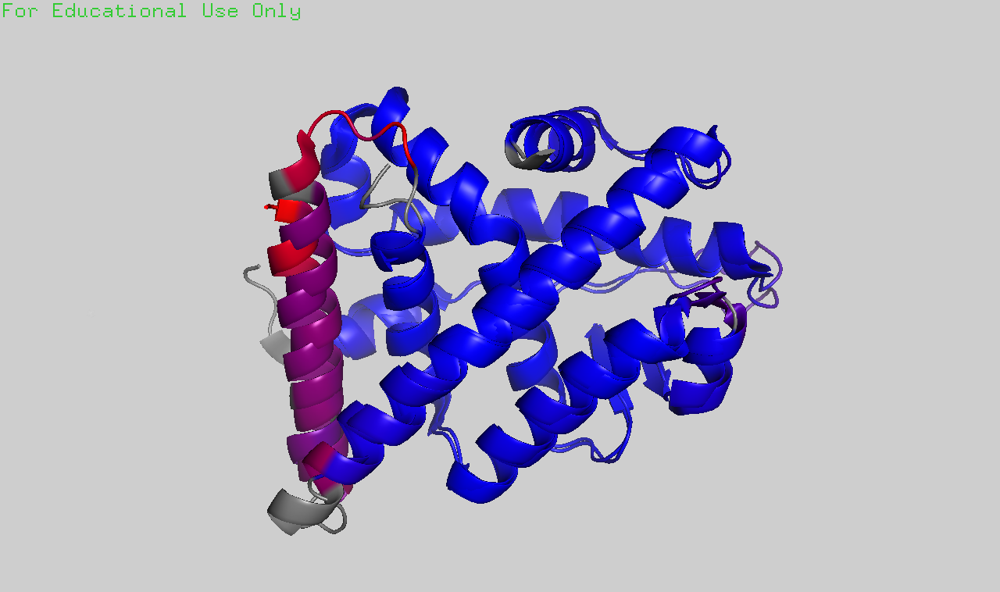

# Structural bioinformatics

## ERRy
Among the choices of biosensors for BPA, we choose ERRy due to its high binding affinity to BPA, compared to those of endogenous ligands including ____E2, …_____

Firstly, our concern is whether the substitution of hERa for ERRy LBD changes the performance of the system. To investigate this question, we superimpose the structures of hERa with ERRy, and color the residues by RMSD.
Retrieving the sequences of ERRy and hERa from PDB files 2GPO and 5WGD, we aligned the 2 sequences globally using the Needleman-Wunsch algorithm. As 2 sequences are highly similar as indicated by 33.1% sequence identity, we proceed to do alignment using the align command in Pymol.
2GPO is the crystal structure of unliganded ERRy LBD with RIP140 coactivator [Wang, et. al, 2006](https://www.jbc.org/article/S0021-9258(20)71951-4/fulltext). Here, we see ERRy adopts an agonist conformation with H12 covering the ligand binding pocket, creating an interacting surface for the NR-box (or LXXLL motif) containing coactivator, RIP140. We choose 5WGD as an analogous structure of ER-alpha, as ERa is also in its transcriptionally active conformation here, via binding to SRC2 and an agonist. The 2 structures are highly similar, with r.m.s.d = 0.735 A over 1067 atoms, while the most deviated region being the N-terminus end of helix 10.

[Explain the potential result in wetlab experiment: i.e. dimerization, transcriptional activity, interaction with HSP90.]

As demonstrated in [Greschik et. al, 2002](https://www.cell.com/AJHG/fulltext/S1097-2765(02)00444-6) study, ERRy-LBD without ligand superimposes well with E2-bound ERa with a root-mean-square deviation of only 1.05A. Furthermore, mutants with filled-up ligand binding cavity is still able to interact with co-activators SRC-1 and are transcriptionally active. 
Hence, we deduced that to increase the sensitivity of the system, the increase in binding affinity of ERRy with BPA might not be sufficient, as some fractions of apo-ERRy may escape HSP90 and activate transcription, leading to false positive results. This motivates us to our second initiative, to increase the binding of apo-ERRy to HSP90.

HSP90, a chaperone protein required for GR maturation,

Understand why ERRy doesn’t bind to E2 & how ERRy binds to BPA => conduct virtual screening of the new binding pocket

Firstly, ____orphan nuclear receptor with structure homologous to ER (estrogen receptor), ERRy

