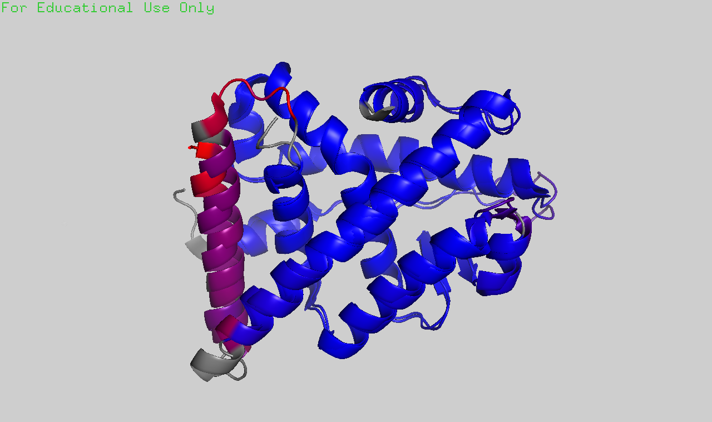

# Structural bioinformatics

## ERRy
Among the choices of biosensors for BPA, we choose ERRy due to its high binding affinity to BPA, compared to those of endogenous ligands including ____E2, …_____

Firstly, our concern is whether the substitution of hERa for ERRy LBD changes the performance of the system. To investigate this question, we superimpose the structures of hERa with ERRy, and color the residues by RMSD.
Retrieving the sequences of ERRy and hERa from PDB files 2GPO and 5WGD, we aligned the 2 sequences globally using the Needleman-Wunsch algorithm. As 2 sequences are highly similar as indicated by 33.1% sequence identity, we proceed to do alignment using the align command in Pymol.
2GPO is the crystal structure of unliganded ERRy LBD with RIP140 coactivator [Wang, et. al, 2006](https://www.jbc.org/article/S0021-9258(20)71951-4/fulltext). Here, we see ERRy adopts an agonist conformation with H12 covering the ligand binding pocket, creating an interacting surface for the NR-box (or LXXLL motif) containing coactivator, RIP140. We choose 5WGD as an analogous structure of ER-alpha, as ERa is also in its transcriptionally active conformation here, via binding to SRC2 and an agonist. The 2 structures are highly similar, with r.m.s.d = 0.735 A over 1067 atoms, while the most deviated region being the N-terminus end of helix 10.

As shown in the first crystal structure of antagonist-bound ER LBD, resolved by Brzozowski AM, et. al (1997), the dimerization interface of ER involves the zipper-like interactions between helices 11, and other contacts among helices 8, 9, and 10. Hence, the difference in helix 10 may affect the dimerization of ERRy, which is a pre-requisite for the binding of ERRy to the estrogen-responsive element (ERE) allowing transcription. We illustrated the dimerization interface of ERRy below. 
However, as we use a different activation []. Hence, we speculate that this structural difference has trivial impact on the performance of our system.

As demonstrated in [Greschik et. al, 2002](https://www.cell.com/AJHG/fulltext/S1097-2765(02)00444-6) study, ERRy-LBD without ligand superimposes well with E2-bound ERa with a root-mean-square deviation of only 1.05A. Furthermore, mutants with filled-up ligand binding cavity is still able to interact with co-activators SRC-1 and are transcriptionally active. 

Due to the transcriptionally active unliganded form of ERRy, if there exists a fraction of ERRy unsequestered by HSP90, false positives may still present. Hence, to minimize the basal expression of Luciferase, we need to understand how the binding of BPA to ERRy releases ERRy from HSP90 to derive at the engineering objective for ERRy.

To understand the conformational change of ERRy upon BPA binding, we conducted normal mode analysis using [elNemo](https://www.sciences.univ-nantes.fr/elnemo/). We conducted NMA to understand the conformational changes of ERRy between these states, unliganded, HSP90-bound, and liganded with BPA.
For the structure of HSP90-bound ERRy, as there's no existing model, we created a new model of HSP90-ERRy complex based on HSP90-GR-p23 complex.

## Normal mode analysis

Understand why ERRy doesn’t bind to E2 & how ERRy binds to BPA => conduct virtual screening of the new binding pocket

Firstly, ____orphan nuclear receptor with structure homologous to ER (estrogen receptor), ERRy

