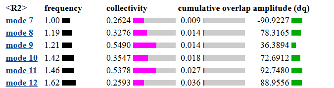
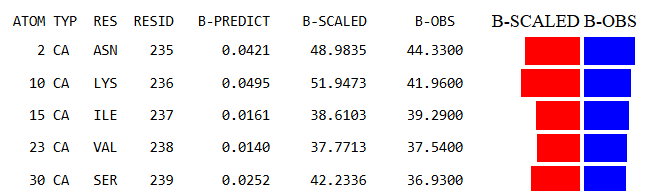
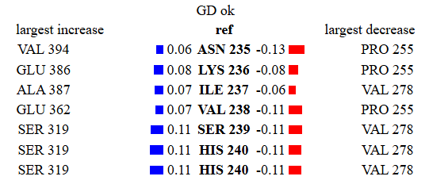
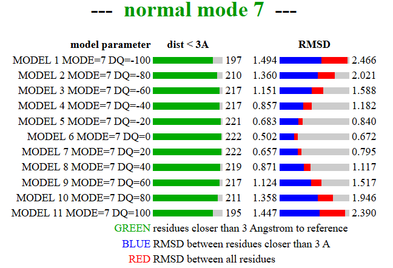
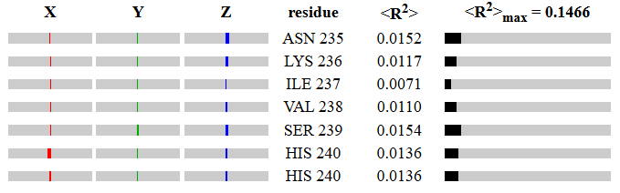

**Note: The documentation may include redundant details for the purpose of understanding the bioinformatics analyses. Bold means requiring validation of info.**

# Structural bioinformatics

## Chimeric activator structure

## ERRg

Among the choices of biosensors for BPA, we choose ERRg due to its high binding affinity to BPA (-9.9 kcal/mol), compared to those of endogenous ligands including E2 (-7.5 kcal/mol), as shown in molecular docking analyses by [Pathak et. al, 2024.](https://www.sciencedirect.com/science/article/pii/S026974912400263X)

Firstly, our concern is whether the substitution of hERa for ERRg LBD changes the performance of the system.
To investigate this question, we superimpose the structures of hERa with ERRg, and color the residues by RMSD.
Retrieving the sequences of ERRg and hERa from PDB files 2GPO and 5WGD, we aligned the 2 sequences globally using the Needleman-Wunsch algorithm.
As 2 sequences are highly similar as indicated by 33.1% sequence identity, we proceed to do alignment using the align command in Pymol.

2GPO is the crystal structure of unliganded ERRg LBD with RIP140 coactivator [Wang, et. al, 2006](https://www.jbc.org/article/S0021-9258(20)71951-4/fulltext).
Here, we see ERRg adopts an agonist conformation with H12 covering the ligand binding pocket, creating an interacting surface for the NR-box (or LXXLL motif) containing coactivator, RIP140.
We choose 5WGD as an analogous structure of ER-alpha, as ERa is also in its transcriptionally active conformation here, via binding to SRC2 and an agonist.
The 2 structures are highly similar, with r.m.s.d = 0.735 A over 1067 atoms, while the most deviated region being the N-terminus end of helix 10.

As shown in the first crystal structure of antagonist-bound ER LBD, resolved by [Brzozowski, et. al (1997)](https://www-nature-com.ep.fjernadgang.kb.dk/articles/39645), the dimerization interface of ER involves the zipper-like interactions between helices 11, and other contacts among helices 8, 9, and 10.
Hence, the difference in helix 10 indicates the selectivity in dimerization of ERRg versus that of ERa.

As demonstrated in [Greschik et. al, 2002](https://www.cell.com/AJHG/fulltext/S1097-2765(02)00444-6) study, mutants with filled-up ligand binding cavity is still able to interact with co-activators SRC-1 and are transcriptionally active.
This illustrates a fundamental difference in the original system with ERa and our system with ERRg - ERa is ligand-activated while ERRg is not, which might lead to false positive signals in the absence of BPA.
Hence, to arrive at better engineering objectives for ERRg as the biosensor for BPA, we use computational methods to understand how the binding of BPA changes ERRg.
Also, we seek to increase the affinity of ERRg to HSP90, a chaperone protein known to aid in the folding of steroid hormone receptors which might be unfolded in heated conditions.

### Conformational changes of ERRg upon binding to BPA

\_\_\_\_ data from MD simulations with GROMACS\_\_\_\_\_

Based on MD simulation data of unliganded and PBA-bound ERRg in water, we conclude that BPA binding stabilizes ERRg by adding structural restraints, which confers BPA's ERRg agonist function.
Hence, increasing the binding affinity of ERRg to BPA will stabilize the agonist conformation and make our system's output less distinguished.

### Minimize leaky transcription:

#### Basis for increasing ERRg affinity to HSP90:

While HSP90's chaperone activity has been reported with most other steroid hormone receptors, including estrogen receptor (ER), glucocorticoid receptor (GR),and the orphan receptor ERRb on BioGrid database, there's no report of ERRg interaction with HSP90.
This is further complicated by the varying dependence of each nuclear receptor's hormone binding ability on HSP90.
Specifically, while HSP90 is required for GR's hormone binding in all conditions, ER's hormone binding ability is unaffected by the absense of HSP90 in vitro but decreases in vivo [Fliss et. al 2000](https://www-sciencedirect-com.ep.fjernadgang.kb.dk/science/article/pii/S0960076000000376?casa_token=nUALZ_p2GF0AAAAA:MjQsrAGMdYSj9eiPXtMmm7wM4eKhYfOaXJ1lVrjTuwJLJAcfIOg00pNdVWlmVFu2TIsLnfUU0g).
To account for this, the authors deduce that due to the higher concentration of intracellular proteins, HSP90 is only involved in the ab initio folding of ER and once folded, ER is stable enough at physiological condition.
Based on this, we propose that ERRg’s reliance on HSP90 is similar to ERa’s due to their structural resemblance.
Our goal is to enhance ERRg’s dependence on HSP90, akin to GR.

#### Superimpose GR and ERRg

Superimposing GR and ERRg structures and sequences, we report some noticeable differences in their structure: the presence of a hydrophobic patch towards the N-term which is threaded through the gap of HSP90 homodimer and a beta sheet following the activation helix, signature of the 3C family of nuclear receptor. We hypothesize that introducing a hydrophobic patch, with the sequence "ATLPQLTPT", prior to the first helix of ERRg will increase the binding affinity of ERRg to HSP90. Hence, we use AlphaFold2 to predict the structure of the new ERRg mutant and generate a model for the mutant GR with HSP90 and p23 co-chaperone using HADDOCK 2.4.

#### Normal mode analysis and Elastic Net Model

Previous structural studies (**citations**) showed that protein conformational change can be described by a handful of protein motions at minimum energy level.
These, normal modes are orthogonal to each other, meaning that the conformational change can be described by superimposing all normal modes.

NMA starts with a potential energy surface of a protein, i.e. dependent variable being the potential V, and independent variables being the components of the system (the coordinates).
Then a Hessian matrix is calculated from the potential energy function, containing all the second derivatives of V against every components in the system.
Referring to equation 2 in [Bauer and Bauerová-Hlinková (2020)](https://www.intechopen.com/chapters/73720), i and j are like x and y axes, and if the protein has 100 atoms, the Hessian matrix will have the size of 100x100.
If we describe each atom in 3D - x,y,z, the size of the Hessian matrix will be 300x300 (change in V against xy, yz, and xz) then.

Via eigen-decomposition of this Hessian matrix, we retrieve eigenvectors as normal mode vectors, describing ONLY the direction and the displacement of each particle relative to each other.
We also receive the eigenvalues, which is the square of the vibration frequency of a particular mode.
The lower the frequency of a mode, the larger the amplitude of the displacement, often indicating large-scale conformational change and involvement of large number of atoms.
Hence, elNemo only displays the top 5, possible non-trivial, normal modes with lowest frequencies.

The Elastic Net Model (ENM) is a modification to conduct NMA in a less computationally expensive way.
Instead of using the potential energy function derived from a force field - equation 1 [Bauer and Bauerová-Hlinková (2020)](https://www.intechopen.com/chapters/73720), ENM uses the Hooke potential, based on a simplified model of a protein structure where atoms are connected by harmonic springs.

##### NMA for ERRg structural changes upon BPA binding:

[link](https://www.sciences.univ-nantes.fr/elnemo/nmode.cgi?ID=2407140914343669058)

For NMA run, we used 2GP7_A (chain A of unliganded ERRg LBD) and 2E2R (BPA-bound ERRg).

1.  Properties of 100 normal modes

We can see that modes 7 and 8 rather describe local movements, as they have lower collectivity of 0.2624 and 0.3276 respectively.
Collectivity of 1 means that the conformational change described by the mode involves displacement from all atoms.

[Elaborate more on how exactly, what helices for eg, is this reflected in the animations for 5 modes.]

However, the overlap of these modes with the conformational change are very small, meaning that the mode explains very little of the transition from conformation 1, apo ERRg, to conformation 2, BPA-bound ERRg.
We speculate that the reason is due to the poor fit of the second conformation to the first one.
Ideally, 2 models representing 2 states should have the same number of atoms, with residues being numbered identically.
Or else, Elnemo coputes RMSD between normal mode perturbed models and the second conformaiton to identify the perturbed model that best describe the associated protein movement.
Hence, we speculate that some modifications to ERRg models are needed to improve the fit.

2.  B-factor analysis

B-factors are computed from the normalized mean displacement ($R^2$) of the first 100 normal modes.
The correlation between the predicted and observed B-factors (of the first model, the starting conformation) indicate how well the protein flexibility in crystal environment is described by normal modes.
[Link to text](https://www.sciences.univ-nantes.fr/elnemo/tmp/2407140914343669058.dir/2407140914343669058.bfactors.pred).
B-factor reflects the positional flexibility of atoms within crystal lattices, or how much they deviate from the average positions due to thermal vibrations.

[NEED TO EXPLAIN WHAT IS $R^2$ HERE]

3.  CA distance fluctuations

For each mode, 10 perturbed models are created, and the degree of perturbation is based on an arbitrary unit.
This module shows the relative movements between residues in the mode k, or the degree to which Ca atoms vary in position between their maximally and minimally perturbed models.

This module gives an insight in rigid and flexible blocks of residues within a given mode.

4.  RMSD analysis

RMSD between the perturbed model and the second conformational state.

5.  $R^2$ analysis

Normalized mean square displacement of all Ca atoms in the proteins for this mode.
It illustrates blocks of flexible and fixed residues in the proteins, so it serves a function quite like CA distance fluctuation module.

The results from NMA confirmed the MD simulations results that ERRg structure is stabilized upon BPA binding.

Understand why ERRg doesn’t bind to E2 & how ERRg binds to BPA => conduct virtual screening of the new binding pocket

